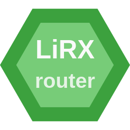

<h1 align="center">LiRX / Router - A router for LiRX / DOM</h1>

<p align="center">
  
  <br>
  <i>
    <strong>@lirx/router</strong> is a performant router for
    <a href="hhttps://github.com/lirx-js/dom">
     @lirx/dom
    </a>
  </i>
</p>

<p align="center">
  <a href="https://www.npmjs.com/package/@lirx/router">
    
  </a>
  
  
  
</p>

<hr>

**It is now in BETA. Please use with caution and provide feedback.**

## 📦 Installation

```bash
yarn add @lirx/router
# or
npm install @lirx/router --save
```

This library supports:

- **common-js** (require): transpiled as es5, with .cjs extension, useful for old nodejs versions
- **module** (esm import): transpiled as esnext, with .mjs extension (requires node resolution for external packages)

In a **node** environment the library works immediately (no extra tooling required),
however, in a **browser** environment, you'll probably need to resolve external imports thought a bundler like
[snowpack](https://www.snowpack.dev/),
[rollup](https://rollupjs.org/guide/en/),
[webpack](https://webpack.js.org/),
etc...
or directly using [skypack](https://www.skypack.dev/):
[https://cdn.skypack.dev/@lirx/router](https://cdn.skypack.dev/@lirx/router)
